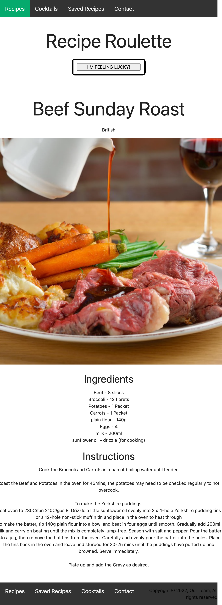

# Recipe-Roulette

Recipe Roulette allows the user to randomly generate meals and cocktail recipes using server side API and save their favorite generated recipes 

## User Story
 As an adventurous homecook, 
 I want help choosing exciting meal and cocktail recipes 
 so I can cook something new

## Instalation
* Clone with repository: https://github.com/ArturoSer/Recipe-Roulette
    * git clone: git@github.com:ArturoSer/Recipe-Roulette.git
* Open Repo with VS Code or IDE of your choice
* Open Index.html with Live Server to inspect Code or visit: PLACE HOLDER 

## Mockup
* The following picture shows the web application's functionality:

## Resources 
* CSS framework: 
    * Materialize: https://materializecss.com/
* Serverside APIS: 
    * mealDB: https://www.themealdb.com/api.php
    * cocktailDB: https://www.thecocktaildb.com/

## Directions for Future Development 
* Add a search option so users can look up recipes by ingredients 

## Contributors 
* Arturo Serrato: https://github.com/ArturoSer
* Hunter Harvell: https://github.com/HunterHarvell
* Jon Mauch: https://github.com/jsmauch80
* Genevieve Ferrari: https://github.com/gjferrari
